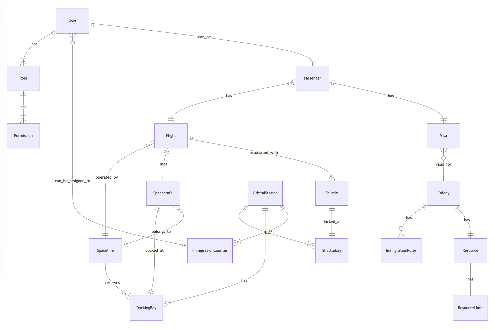
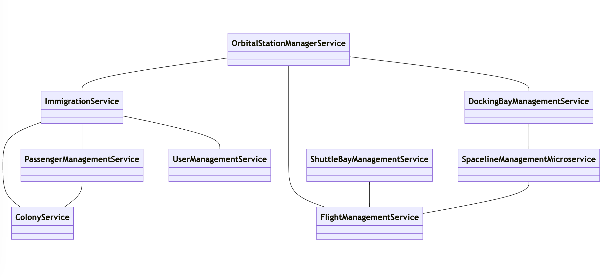
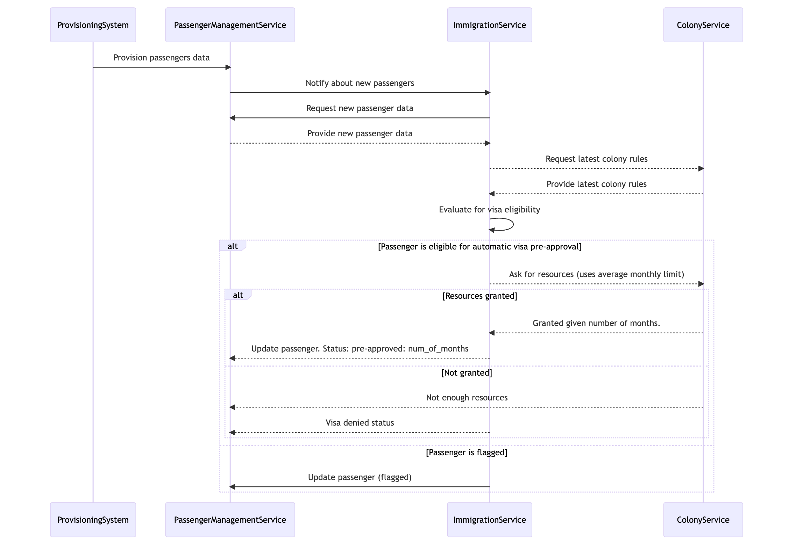
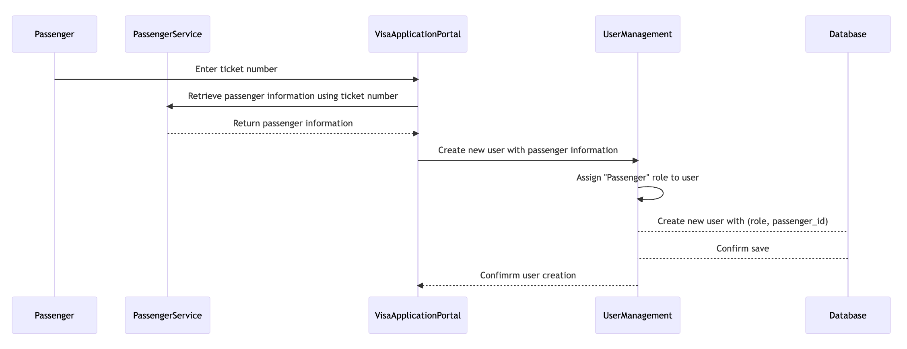
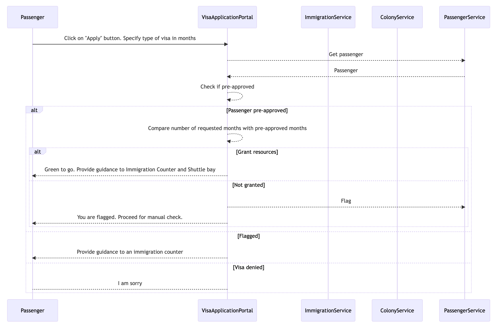
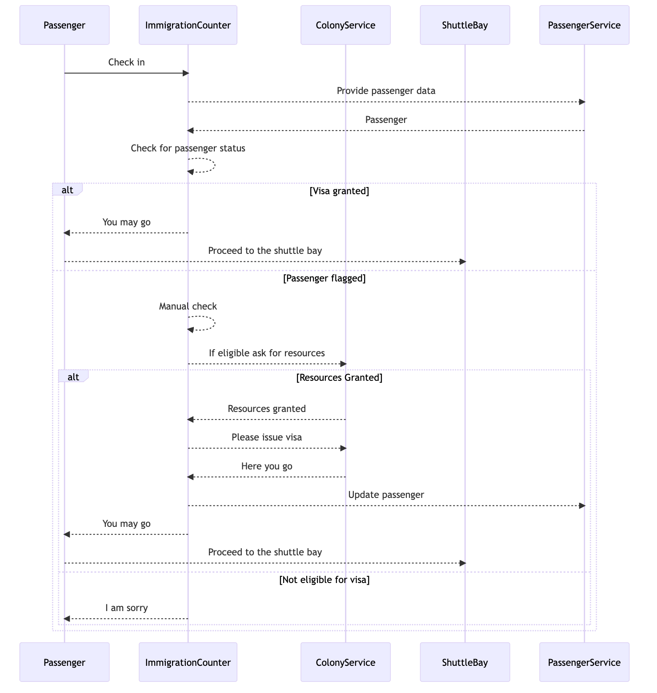
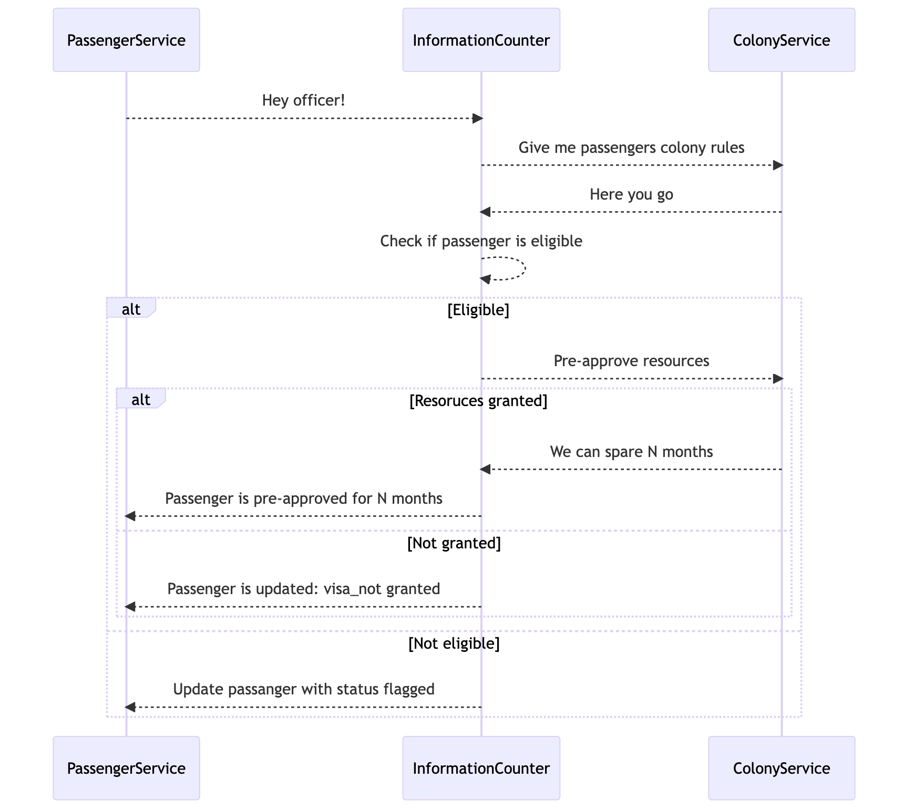

# 4. Information System Architecture

In this section, we will define the data entities, relationships, data flows, and applications within the Mars immigration system.

## 4.1 Data Architecture

The following picture represents a high level data model:

### Data Entities

### Passenger
Represents a passenger. It stores information required for immigration procedures, guidance through the orbital station, and boarding information.

Attributes:

- id: Unique identifier for the passenger
- name: Full name of the passenger
- ticketNumber: Unique ticket number for their journey
- healthCheck: Health check results for the passenger
- criminalRecord: Criminal record information for the passenger
- visa: Associated visa information for the passenger
- specialization: Job or skill the passenger posses (eg. IT, surgeon, etc)
- flightNumber: Number of flight.
- status: status of his visa application

Functions:
- requestGuidance(): Retrieve guidance for the passenger's journey through the orbital station

## Spaceline
This entity represents a company providing transportation to and from Mars. It stores information about the company, their spacecraft, and schedules. 

Attributes:

- id: Unique identifier for the spaceline
- name: Name of the spaceline

## Spacecraft
Represents the spacecraft belonging to a Spaceline, including its passenger capacity.

Attributes:

- id: Unique identifier for the spacecraft
- name: Name of the spacecraft
- capacity: Number of passengers the spacecraft can carry
- spacelineId: Spaceline id

## Colony
This entity represents a Mars colony, with details about the number of inhabitants, resources, and immigration rules.

Attributes:

- id: Unique identifier for the colony
- name: Name of the colony
- inhabitants: Number of current inhabitants in the colony

## ColonyResource
This entity represents resources avaliable for the colony

Attributes:

- id: Unique identifier for the colony
- name: Name of the resource
- colony_id: ID of the colony
- air: available air in m3
- lodging: available lodging in number of places 
- food: availabe food in kilograms

## OrbitalStation
This entity represents an orbital station, either Quaid or Hauser. The station is responsible for 
managing passenger processing, visa controls, and processing times.

Attributes:

- id: Unique identifier for the orbital station
- name: Name of the orbital station
- passengerCapacity: Maximum number of concurrent passengers the station can handle

## Flight
This entity represents a flight between Earth and Mars or between Mars colonies. It includes details about the departure and arrival times, the Spaceline, and the spacecraft.

Attributes

- flightId: Unique identifier for the flight.
- spaceLineID: Spaceline id
- departureTime: The scheduled departure time of the flight.
- arrivalTime: The scheduled arrival time of the flight.
- origin: The location where the flight departs from (Earth or a Mars colony).
- destination: The location where the flight arrives (a Mars colony or Earth).
- spacecraft: The spacecraft used for the flight.
- shuttle: Shuttle assigned for this flight
- passengers: List of passengers

## Shuttle
This entity represents a small transport ship used to transport passengers from the orbital station to their destination colony on Mars or vice versa. 

Attributes

- shuttleId: Unique identifier for the shuttle.
- capacity: The maximum number of passengers the shuttle can carry.
- departureTime: The scheduled departure time of the shuttle.
- arrivalTime: The scheduled arrival time of the shuttle.
- associatedFlight: The flight that the shuttle is associated with.
- shuttle_bay_number: Shuttle bay number for docking.  

## ImmigrationCounter
This entity represents an immigration counter at the orbital station, responsible for visa control and processing of passengers.

Attributes:

- id: Unique identifier for the immigration counter
- officerId: The ID of the immigration officer assigned to the counter
- status: The current status of the counter (e.g., open, closed, occupied)
- orbital_station_id

## Visa
This entity represents a temporary visa issued for passengers traveling to Mars colonies, with details about 
the duration and the colony for which it is valid.

Attributes:

- id: Unique identifier for the visa
- duration: Duration of the visa in Mars months
- colony: The Mars colony for which the visa is valid
- issued_by: ImmigrationCounter id
- time_of_issue: Timestamp

## Role
This entity represents the different roles or actors within the system. 
It defines the specific permissions and access levels granted to each user based on their role. 
Roles can include Passenger, Immigration Officer, Spaceline Dispatcher, Colony Official, and Station Manager. 
Each role has a distinct set of responsibilities and allowed actions within the system.

Attributes:

- id: Unique identifier for the role
- user_id: Identifier of the user with this permission
- name: Name of the role
- permissions: List of system permissions associated with the role

## SystemPermission

This entity represents the specific actions or operations that a user with a certain role is allowed to perform within the system. 

Permissions are associated with roles, and users with a specific role inherit the permissions assigned to that role. 
Examples of permissions can include creating, updating, or deleting records, accessing certain features 
or functionalities, and managing specific parts of the system.

Attributes:

- id: Unique identifier for the permission
- name: Name of the permission
- description: Description of the permission

## User
This entity represents a user of the system, with associated personal information and a role. Each user can have one or more roles, which determine their permissions and allowed actions within the system.

Attributes:

- id: Unique identifier for the user
- name: Full name of the user
- email: Email address of the user
- password: Hashed password for the user
- roles: List of roles assigned to the user

## DockingBay
This entity represents a docking bay at the orbital station where spacecraft can dock and undock. It includes details about its current status and associated spacecraft.

Attributes:

- id: Unique identifier for the docking bay
- status: The current status of the docking bay (e.g., available, occupied, under maintenance)
- spacecraft: The spacecraft currently docked at the docking bay (if any)
- orbital_station_id

Functions:
- updateStatus(newStatus): Update the status of the docking bay
- assignSpacecraft(spacecraft: Spacecraft): Assign a spacecraft to the docking bay
- unassignSpacecraft(): Remove the spacecraft assignment from the docking bay

## Shuttlebay
This entity represents a shuttle bay at the orbital station or a Mars colony where shuttles can dock and undock. It includes details about its current status and associated shuttle.

Attributes:

- id: Unique identifier for the shuttle bay
- status: The current status of the shuttle bay (e.g., available, occupied, under maintenance)
- shuttle: The shuttle currently docked at the shuttle bay (if any)
- orbital_station_id

Functions:
- updateStatus(newStatus): Update the status of the shuttle bay
- assignShuttle(shuttle: Shuttle): Assign a shuttle to the shuttle bay
- unassignShuttle(): Remove the shuttle assignment from the shuttle bay

## ImmigrationRule
Represents a rule or requirement for immigration to a Mars colony. These rules are used to determine if a passenger is eligible for automatic visa granting or if they need to go through manual visa processing at an immigration counter.

Attributes:

- id: Unique identifier for the immigration rule
- colonyId: The ID of the Mars colony the rule is associated with
- ruleType: The type of the rule (e.g., health, criminal record, specialization)
- ruleDescription: A description of the rule (e.g, min age, criminal record status atc.)

## 4.2 Application Architecture

### Front End Applications

- **Visa Application Portal**: A web or mobile application that allows passengers to register and apply for a temporary visa.
- **Immigration Database**: A centralized database that stores all data related to passengers, visas, colonies, users, and docking bays.
- **Reporting Tools**: Tools and applications that generate reports and insights based on the system's data for authorized personnel.
- **Docking Bay Dispatch**: An application that manages docking bay assignments for arriving and departing spacecraft, used by Spaceline Dispatchers and Station Managers.

## 4.3 Microservices

<!-- Here's a brief summary of which microservices are responsible for database which entities:

Passenger Management Service - Passenger
Immigration Service - ImmigrationCounter
Docking Bay Management Service - DockingBay
Colony Service - Colony, ImmigrationRule, ColonyResources
Orbital Station Manager Service - OrbitalStation, 
Shuttle Bay Management Service - Shuttle, Shuttlebay
User Management Service - User, Role, SystemPermission
Spaceline Management Microservice - Spaceline, Spacecraft
Flight Management Service - Flight -->

### 4.3.1 Passenger Management Service

Responsible for handling passenger-related data and operations, such as registration, updating passenger details, and retrieving passenger information.

#### Endpoints:

- `POST /passengers`: Register a new passenger
- `GET /passengers`: Get a list of passengers
- `GET /passengers/{id}`: Get passenger details
- `PUT /passengers/{id}`: Update passenger details
- `DELETE /passengers/{id}`: Delete a passenger

### 4.3.2 Immigration Service

Handles the validation of passengers' documents. 
Automates visa validation and send requests to Colony official service to issue visa. It can be also done manually.
Requests visa rules from Colony Official service. Visa should be granted when a passenger fulfills colonys criteria and is granted resources from colony. Than officer can approve the visa.

Assign and unassign users(immigration officers) to counters
Create, update, and delete Immigration counters.
Process passenger visa applications and status updates
Provides metrics on average visa processing time

#### Endpoints:

- `POST /immigration/counters`: Create a new immigration counter
- `GET /immigration/counters`: Get a list of immigration counters
- `PUT /immigration/counters/{id}`: Update an immigration counter
- `DELETE /immigration/counters/{id}`: Delete an immigration counter
- `POST /immigration/counters/{id}/assign`: Assign a user to an immigration counter
- `POST /immigration/counters/{id}/unassign`: Unassign a user from an immigration counter
- `POST /immigration/visas`: Process a passenger visa application
- `PUT /immigration/visas/{id}`: Update visa status
- `GET /immigration/metrics`: Get average visa processing time

### 4.3.3 Docking Bay Management Service

Manages the assignment and scheduling of docking bays for incoming and outgoing ships, ensuring efficient utilization of resources.
Allows docking bay reservation.

Provides information about docking bay availability.

#### Endpoints:

- `POST /docking-bays`: Create a new docking bay
- `GET /docking-bays`: Get a list of docking bays
- `PUT /docking-bays/{id}`: Update a docking bay
- `DELETE /docking-bays/{id}`: Delete a docking bay
- `GET /docking-bays/availability`: Get docking bay availability

### 4.3.4 Colony Service

Provides an interface for colony officials to manage colony-specific rules and regulations. Issues visas for passengers based on approval from Immigration Service.

Create, update, and delete colony information
Manage colony resources and immigration rules
Supports or denies resources for arriving passengers (automatically or manually)
Retrieve planned arrivals data
Create, update, provides, and delete visa.
Create, update, provides, and delete immigration rules.

#### Endpoints:

- `POST /colonies`: Create a new colony
- `GET /colonies`: Get a list of colonies
- `PUT /colonies/{id}`: Update a colony
- `DELETE /colonies/{id}`: Delete a colony
- `POST /colonies/{id}/rules`: Create immigration rules
- `GET /colonies/{id}/rules`: Get immigration rules
- `PUT /colonies/{id}/rules/{ruleId}`: Update immigration rules
- `DELETE /colonies/{id}/rules/{ruleId}`: Delete immigration rules
- `POST /colonies/{id}/visas`: Create a visa
- `GET /colonies/{id}/visas`: Get a list of visas
- `PUT /colonies/{id}/visas/{visaId}`: Update a visa
- `DELETE /colonies/{id}/visas/{visaId}`: Delete a visa
- `GET /colonies/{id}/arrivals`: Retrieve planned arrivals data

### 4.3.5 Orbital Station Management Service

Enables the orbital station managers to oversee the entire immigration process, monitor the status of docking bays, and coordinate with colony officials.

Create, update, and delete orbital station information

Retrieve visa processing time, passenger capacity, and forecasts
Retrieve spacecraft schedules

By aggregating passenger data from related services like PassengerManagementService, FlightManagementService, and DockingBayManagementService, it can calculate the percentage of station passenger capacity used at any given moment.

#### Endpoints:

- `POST /orbital-stations`: Create a new orbital station
- `GET /orbital-stations`: Get a list of orbital stations
- `PUT /orbital-stations/{id}`: Update an orbital station
- `DELETE /orbital-stations/{id}`: Delete an orbital station
- `GET /orbital-stations/{id}/processing-time`: Get visa processing time
- `GET /orbital-stations/{id}/capacity`: Get passenger capacity and forecasts
- `GET /orbital-stations/{id}/schedules`: Get spacecraft schedules

### 4.3.6 Shuttle Bay Management Service 

The Shuttle Service is responsible for managing the shuttles and their schedules between the orbital station and the Mars colony. This service provides endpoints for creating, updating, retrieving, and deleting shuttle schedules.
Assign and unassign shuttles to shuttle bays.
Assign and unassign shutlles to flights.

#### Endpoints:

- `POST /shuttle-bays`: Create a new shuttle bay
- `GET /shuttle-bays`: Get a list of shuttle bays
- `PUT /shuttle-bays/{id}`: Update a shuttle bay
- `DELETE /shuttle-bays/{id}`: Delete a shuttle bay
- `POST /shuttles`: Create a new shuttle
- `GET /shuttles`: Get a list of shuttles
- `PUT /shuttles/{id}`: Update a shuttle
- `DELETE /shuttles/{id}`: Delete a shuttle
- `POST /shuttles/{id}/assign-bay`: Assign a shuttle to a shuttle bay
- `POST /shuttles/{id}/unassign-bay`: Unassign a shuttle from a shuttle bay
- `POST /shuttles/{id}/assign-flight`: Assign a shuttle to a flight
- `POST /shuttles/{id}/unassign-flight`: Unassign a shuttle from a flight

### 4.3.7 User Management Service
Create, update, and delete user information
Create, update, and delete roles and permissions
Handles user authentication and authorisation.

#### Endpoints:

- `POST /users`: Create a new user
- `GET /users`: Get a list of users
- `PUT /users/{id}`: Update a user
- `DELETE /users/{id}`: Delete a user
- `POST /roles`: Create a new role
- `GET /roles`: Get a list of roles
- `PUT /roles/{id}`: Update a role
- `DELETE /roles/{id}`: Delete a role
- `POST /permissions`: Create a new permission
- `GET /permissions`: Get a list of permissions
- `PUT /permissions/{id}`: Update a permission
- `DELETE /permissions/{id}`: Delete a permission
- `POST /auth/login`: Authenticate a user
- `POST /auth/logout`: Logout a user

### 4.3.8 Flight Management Microservice

Create, update, and delete flight information
Retrieve and update flight schedules
Assign and remove spacecrafts from flights. 
Reserves shuttles and shuttlebays for a flight. 

#### Endpoints:

- `POST /flights`: Create a new flight
- `GET /flights`: Get a list of flights
- `PUT /flights/{id}`: Update a flight
- `DELETE /flights/{id}`: Delete a flight
- `GET /flights/{id}/schedules`: Retrieve and update flight schedules
- `POST /flights/{id}/assign-spacecraft`: Assign a spacecraft to a flight
- `POST /flights/{id}/remove-spacecraft`: Remove a spacecraft from a flight
- `GET /flights/planned-arrivals`: Get a list of planned arrival flights
- `GET /flights/planned-departures`: Get a list of planned departure flights

### 4.3.9 Spaceline Management Microservice

Requests docking bay assignemnts and time slot for arrival, departure or maintenance.
Provides information about planned arrivals and departures (flights).
Provides information about spacecraft and capacities.

Create, update, and delete spaceline information

Manage spacecrafts and schedules for spacelines
Request and receive docking bay assignments and information
Receive not-allowed passengers list

Create, update, and delete spacecraft information
Manage spacecraft capacities

#### Endpoints:

- `POST /spacelines`: Create a new spaceline
- `GET /spacelines`: Get a list of spacelines
- `PUT /spacelines/{id}`: Update a spaceline
- `DELETE /spacelines/{id}`: Delete a spaceline
- `POST /spacecrafts`: Create a new spacecraft
- `GET /spacecrafts`: Get a list of spacecrafts
- `PUT /spacecrafts/{id}`: Update a spacecraft
- `DELETE /spacecrafts/{id}`: Delete a spacecraft
- `POST /spacecrafts/{id}/assign-flight`: Assign a spacecraft to a flight
- `POST /spacecrafts/{id}/unassign-flight`: Unassign a spacecraft from a flight
- `GET /spacecrafts/{id}/capacity`: Get spacecraft capacities
- `GET /spacecrafts/{id}/not-allowed-passengers`: Get not-allowed passengers list
- `GET /spacecrafts/{id}/docking-bay-assignments`: Get docking bay assignments

## 5. Front End applications

1. **Visa Application Portal**

2. **Station Operations**

3. **Spacecraft and Shuttle Operations** 

4. **Colony Operations and Resource Allocations**

5. **Admin and Provisioning**

## 5. Use Cases

## 5.1 Provisioning and Visa Pre-Approval

## 5.1 PassengerRegistration

Passengers arriving at the Mars station register using the web or mobile application.

## 5.2 Visa Application

### 5.2.1 In Application Portal

### 5.2.1 At The Immigration Counter

## 5.3 Colony Rules Checking and Resource Granting

